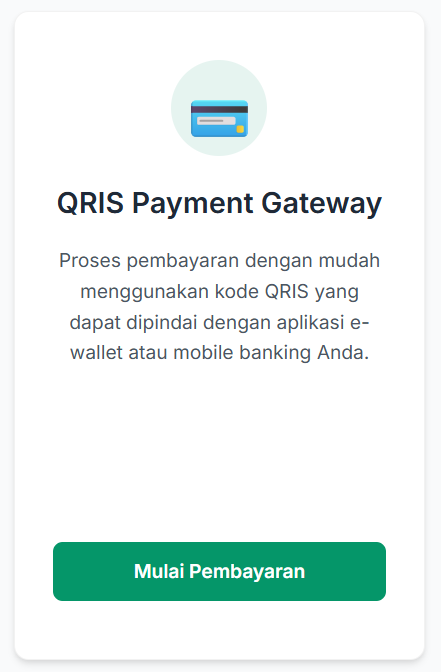

# QRIS-tutorial
Tutorial QRIS Payment Gateway - Crowdfunding
DIMOHON ARAHAN DI BACA DENGAN BENAR

1. Pastikan anda sudah masuk ke link [transaksi](https://www.do.my.id/crowdfunding/index.html)

2. Pilih menu QRIS Payment Gateway.

 

3. Tunggu antrian karena ada pembaayaran berlangsung.
   
4. Setelah itu akan diminta untuk memasukan jumlah pembayaran. *sesuaikan dengan yang akan di bayarkan.

 

4. Buka aplikasi e-wallet di ponsel anda untuk melakukan pembayaran melalui QRIS.

5. Lalu scan barcode yang tertera dan masukan jumlah sesuai yang sudah di input di awal.
   

 

6. Tunggu waktu hingga selesai dan JANGAN PERNAH REFRESH/PINDAH/MENUTUP TAB TERSEBUT!

7. Jika tampilan sudah seperti ini maka pembayaran sudah selesai dan berhasil.

 

Jika terjadi kendala saat melakukan pembayaran hubungi Gilar(+62 853-1292-4192)
